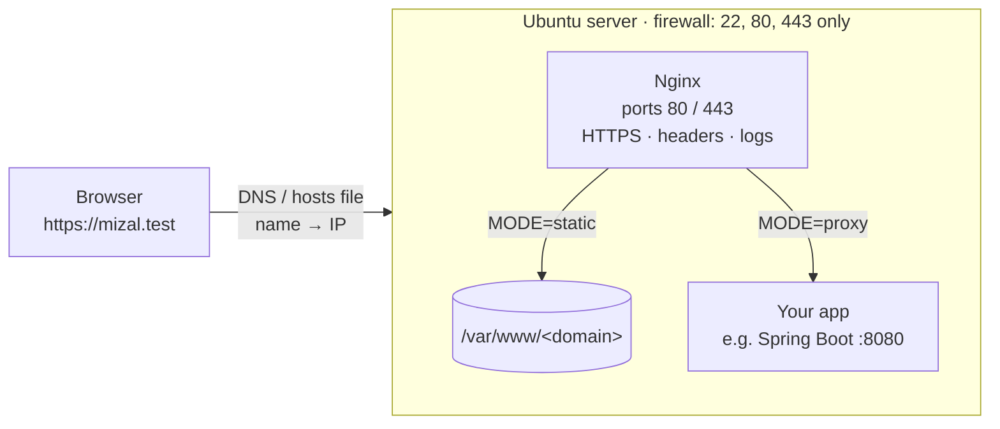

# Nginx starter: your own domain on Ubuntu

A reusable setup for putting a website or app on your own domain with **Nginx**. Fill in one settings
file, run one script, and you get a working site: static files or a reverse proxy to your app,
over HTTP or HTTPS, with a firewall and sensible defaults.

It runs the same way on a **local VirtualBox VM** (practice, with a `.test` domain) and on a **VPS**
(real domain, free Let's Encrypt certificate). Every config file is commented, so the repo doubles as
Nginx study notes.

## How a request flows



## Quick start

On a fresh Ubuntu machine (first time? see [VirtualBox setup](docs/virtualbox-setup.md)):

```bash
git clone https://github.com/amirizalrahmat0799/nginx-starter.git
cd nginx-starter
cp site.env.example site.env     # edit DOMAIN, MODE, HTTPS
sudo ./scripts/setup.sh
```

Change `site.env` and re-run the script any time; it's safe to run repeatedly.

## Settings ([`site.env`](site.env.example))

| Setting | Values | Meaning |
|---|---|---|
| `DOMAIN` | `mizal.test`, `yourdomain.com` | The name the site answers to |
| `INCLUDE_WWW` | `true` / `false` | Also answer on `www.<DOMAIN>` |
| `MODE` | `static` | Serve files from `/var/www/<DOMAIN>` |
| | `proxy` | Forward requests to `UPSTREAM` (your app) |
| `UPSTREAM` | `http://127.0.0.1:8080` | Where the app listens (proxy mode) |
| `HTTPS` | `none` | Plain HTTP |
| | `self-signed` | HTTPS for the local VM (browser warning, still encrypted) |
| | `letsencrypt` | Trusted certificate, auto-renewing. VPS with real DNS only, see [Going public](docs/going-public.md) |
| `EMAIL` | your email | Let's Encrypt expiry notices |

Common combinations:

| Goal | Settings |
|---|---|
| Learn on the local VM | `DOMAIN=mizal.test MODE=static HTTPS=none` |
| Practise HTTPS locally | `DOMAIN=mizal.test HTTPS=self-signed` |
| Public landing page | `DOMAIN=yourdomain.com MODE=static HTTPS=letsencrypt` |
| Public Spring Boot API | `DOMAIN=api.yourdomain.com MODE=proxy UPSTREAM=http://127.0.0.1:8080 HTTPS=letsencrypt` |

## What's in the repo

| Path | What it is |
|---|---|
| [`scripts/setup.sh`](scripts/setup.sh) | Installs Nginx, sets the firewall, renders the templates, tests and reloads. Read it top to bottom: each step is commented |
| [`nginx/templates/`](nginx/templates) | Site config templates. `${DOMAIN}` etc. are filled from `site.env` |
| `site-http.conf.template` / `site-https.conf.template` | The `server` blocks: which ports and names, which certificate |
| `body-static.conf.template` / `body-proxy.conf.template` | What the site does: serve files, or forward to the app |
| [`nginx/snippets/`](nginx/snippets) | Reusable pieces: security headers, proxy headers, TLS settings |
| [`nginx/conf.d/starter.conf`](nginx/conf.d/starter.conf) | Server-wide settings (hide version, WebSocket support) |
| [`html/index.html`](html/index.html) | Placeholder page for static mode |
| [`docs/`](docs) | [VirtualBox setup](docs/virtualbox-setup.md) and [Going public](docs/going-public.md) guides |

Where things end up on the server:

```
/etc/nginx/
├── nginx.conf                         # Ubuntu's main file (untouched); includes the folders below
├── conf.d/starter.conf                # server-wide settings
├── snippets/starter/                  # snippets + the rendered site body (site-<domain>.conf)
├── sites-available/<domain>.conf      # your site's server blocks
└── sites-enabled/<domain>.conf  →     # symlink: "this site is ON"
/var/www/<domain>/                     # static files (static mode)
/var/log/nginx/<domain>.*.log          # per-site access and error logs
/etc/ssl/nginx-starter/                # self-signed certificates
/etc/letsencrypt/                      # Let's Encrypt certificates (managed by certbot)
```

## Nginx in 5 ideas

1. **`server` block = one site.** Nginx picks the block whose `listen` port and `server_name` match the request.
   One Nginx can host many domains this way.
2. **`location` block = one path rule** inside a site. `location /` matches everything; `location /api/` matches
   paths starting with `/api/`. The most specific match wins.
3. **`root` serves files, `proxy_pass` forwards.** `root /var/www/x` maps `/about.html` to `/var/www/x/about.html`.
   `proxy_pass http://127.0.0.1:8080` sends the request to your app and returns its response.
   This is what "reverse proxy" means.
4. **Includes keep configs small.** `include snippets/...;` pastes another file in at that spot.
   Ubuntu loads every file in `conf.d/` and `sites-enabled/` automatically.
5. **Test, then reload.** `nginx -t` checks the config; `systemctl reload nginx` applies it without dropping connections.
   A broken config is never loaded, so the running site keeps working.

## Everyday commands

```bash
sudo nginx -t                              # check config syntax
sudo systemctl reload nginx                # apply config changes
sudo systemctl status nginx                # is it running?
sudo nginx -T | less                       # show the FULL config Nginx sees, all includes expanded
sudo tail -f /var/log/nginx/<domain>.access.log   # watch requests live
sudo tail -f /var/log/nginx/<domain>.error.log    # why something failed
curl -I http://<domain>                    # just the response headers
sudo ufw status                            # firewall rules
```

## Removing a site

```bash
sudo rm /etc/nginx/sites-enabled/<domain>.conf     # turn it off (config stays in sites-available)
sudo nginx -t && sudo systemctl reload nginx
```

## License

[MIT](LICENSE)
